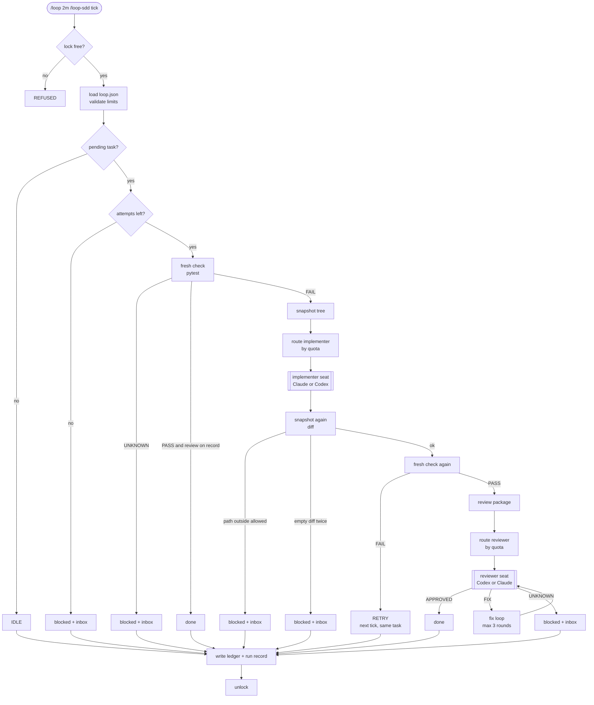
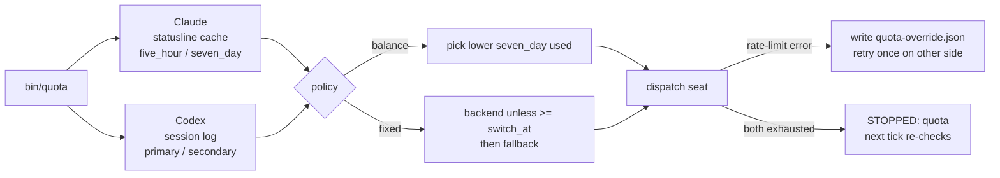

# loop-sdd

A Claude Code skill that runs a bounded, interval-triggered development loop
where every job can be done by either a Claude subagent or an OpenAI Codex
thread, and the choice follows how much of each plan you have left.

> Status: designed, not yet built. The design is in
> [`docs/superpowers/specs/2026-10-08-loop-sdd-design.md`](docs/superpowers/specs/2026-10-08-loop-sdd-design.md).
> This README describes how the skill will behave once implemented and will
> be updated as the implementation lands.

## The idea in one paragraph

You add a task file. Every two minutes a tick fires. The tick takes a lock,
runs your test suite, hands the first pending task to an implementer, checks
that the implementer stayed inside the allowed paths, runs the suite again,
hands the diff to an independent reviewer, and records what happened. The
task is marked done only when the tests pass and the reviewer approves. If
anything cannot be resolved, the task is parked and a note is left for you.
Before every hand-off the controller reads the remaining quota on your
Claude and Codex plans and sends the job to whichever has more room.

This is loop engineering (trigger, bounded attempt, independent check, hard
limits) on top of subagent-driven development (a controller that never writes
code, fresh workers per task, a reviewer who did not write the code).

## Why two models

Addy Osmani's rule: the maker and the verifier should be separate agents so
the model is never grading its own homework. Using a different model family
for the reviewer goes one step further, because Claude and GPT have
different blind spots. And if you pay for both plans, routing by remaining
quota means neither sits idle while the other runs out.

## How a tick works



One attempt per tick. That single rule is what makes it safe to leave
running: a tick is bounded by one implementer run, one review, and at most
three fix rounds, no matter what the models do.

## How routing works



Neither CLI exposes a quota command, but both leave the numbers on disk:

- Claude Code passes a `rate_limits` object to your statusline script. Three
  lines in that script cache it to `~/.claude/usage-cache.json`.
- Codex writes `rate_limits` events into every session log under
  `~/.codex/sessions/`.

The reading is a hint; the dispatch error is the truth. If a seat fails with
a rate-limit error, that backend is marked exhausted until its reset time
and the seat is retried once on the other side.

## Quick start

Prerequisites: Claude Code 2.1.80 or later, the Codex CLI logged in, and the
`codex` MCP server registered (this project uses the
[ARIS codex-exec bridge](https://github.com/wanshuiyin/Auto-claude-code-research-in-sleep)).

```bash
git clone https://github.com/limkoaniun/loop-sdd-lab
cd loop-sdd-lab
claude
```

Inside Claude Code:

```
/loop-sdd init          # scaffolds .loop/, validates loop.json, patches your statusline
/loop-sdd status        # inbox, task table, last run
/loop 2m /loop-sdd tick # start the loop
```

Stop the loop by stopping `/loop`. Nothing is installed in cron.

## Writing a task

One file per task in `tasks/`. Filename order is execution order.

```markdown
---
id: 001
status: pending
attempts: 0
no_progress: 0
seat_overrides: {}
verify: null
---
# Add a parser for infix expressions

Parse `1 + 2 * 3` into an AST. Precedence: `*` and `/` bind tighter than
`+` and `-`. Tests in `tests/test_parse.py` cover precedence, parentheses,
and a malformed-input error.
```

Only the controller changes `status`, and only you move a task out of
`blocked` or `done`. To A/B the two models, give two similar tasks different
`seat_overrides`:

```yaml
seat_overrides: {implementer: {backend: codex}}
```

## Configuring the loop

`loop.json` holds the limits and the routing table.

```json
{
  "check_command": ["python3", "-m", "pytest", "-q"],
  "allowed_paths": ["src/", "tests/"],
  "max_attempts_per_task": 3,
  "max_elapsed_seconds_per_tick": 600,
  "no_progress_limit": 2,
  "fix_rounds_max": 3,
  "routing": {"policy": "balance", "switch_at": 85, "stale_after_seconds": 3600},
  "seats": {
    "implementer": {"backend": "claude", "fallback": "codex", "model": "sonnet", "codex_model": "gpt-5.4"},
    "reviewer":    {"backend": "codex",  "fallback": "claude", "model": "opus",   "codex_model": "gpt-5.4"},
    "re_reviewer": {"backend": "codex",  "fallback": "claude", "model": "sonnet", "codex_model": "gpt-5.4"}
  }
}
```

| Key | What it bounds |
|---|---|
| `max_attempts_per_task` | how many ticks may try one task |
| `max_elapsed_seconds_per_tick` | wall time before a tick refuses to start another seat |
| `no_progress_limit` | consecutive attempts with an empty diff and a failing check |
| `fix_rounds_max` | review-fix-re-review rounds per attempt |
| `routing.switch_at` | used percentage at which a backend is skipped |
| `routing.policy` | `balance` spreads load by weekly usage; `fixed` prefers `backend` |

Zero, negative, or missing limits are refused. Nothing runs.

## The three seats

| Seat | Reads | Returns | Codex sandbox |
|---|---|---|---|
| Implementer | task brief | `DONE` / `DONE_WITH_CONCERNS` / `BLOCKED` / `NEEDS_CONTEXT` | workspace-write |
| Reviewer | brief, report, diff package | `APPROVED` / `FIX` / `UNKNOWN` + findings | read-only |
| Re-reviewer | findings, fix diff package | `ADDRESSED` / `NOT ADDRESSED` per finding | read-only |

The prompt is identical on both backends. Only the dispatch mechanics differ:
the Agent tool for Claude, the `codex` MCP tool for Codex. Seats never spawn
their own subagents, never edit task files, and never weaken a test. A
removed or skipped test is always a Critical finding.

## When the loop stops

| Outcome | Meaning |
|---|---|
| `PASS` | task done: fresh tests pass and reviewer approved |
| `RETRY` | attempt made, tests still fail, budget left; next tick retries |
| `IDLE` | nothing to do |
| `STOPPED` | a limit fired: attempts, no progress, fix rounds, scope, elapsed, quota, seat |
| `UNKNOWN` | the check or reviewer could not judge; task blocked |
| `REFUSED` | lock held or config invalid; nothing changed |

Everything that needs you lands in `.loop/inbox.md`: which task, which tick,
why, and what to edit. `/loop-sdd status` prints it first.

There is no automatic finish. When every task is done or blocked, ticks are
idle until you add more.

## What this does not do

It detects an edit outside the allowed paths after the fact. It cannot
prevent one. It observes quota before and after a seat runs. It cannot cap
spend mid-run. Use a disposable checkout if either matters.

A loop running unattended is a loop making mistakes unattended. The ledger
and the run records in `.loop/runs/` are there so you can read what it did
before you trust it.

## Where the ideas came from

- [Addy Osmani, Loop Engineering](https://addyosmani.com/blog/loop-engineering/): the five primitives, maker/verifier split, state on disk, the human inbox
- [loop-engineering-starter](https://github.com/ravsau/ai-tutorials/tree/main/loop-engineering-starter): the `/loop` plus task-file pattern in its simplest form
- [brittanyellich/loop-board](https://github.com/brittanyellich/loop-board): one file per task, human-only status transitions
- [ching-kuo/claude-codex](https://github.com/ching-kuo/claude-codex): per-seat routing between Claude and Codex
- [goharanwar/claude-codex-review](https://github.com/goharanwar/claude-codex-review): resume the reviewer's thread across fix rounds
- [MarcEspuna/MCP-Codex-reviewer](https://github.com/MarcEspuna/MCP-Codex-reviewer): argue with findings and record why
- [Ralph loops: budgets and stop conditions](https://gautamkhorana.com/blog/claude-code-bounded-agent-loops/): only the verifier flips done; empty diff is no progress
- [obra/superpowers](https://github.com/obra/superpowers) subagent-driven-development: the controller-never-codes pattern this extends

## License

MIT.
